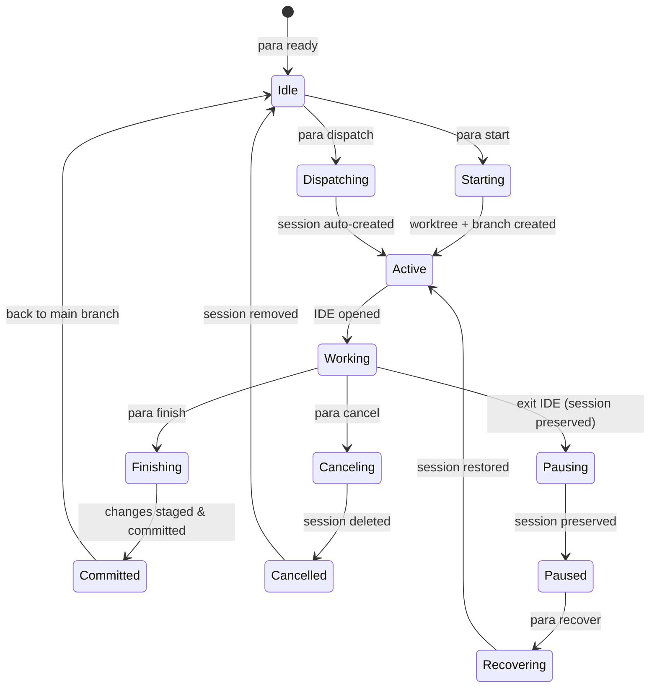
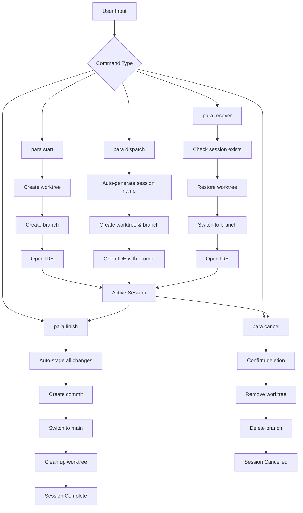
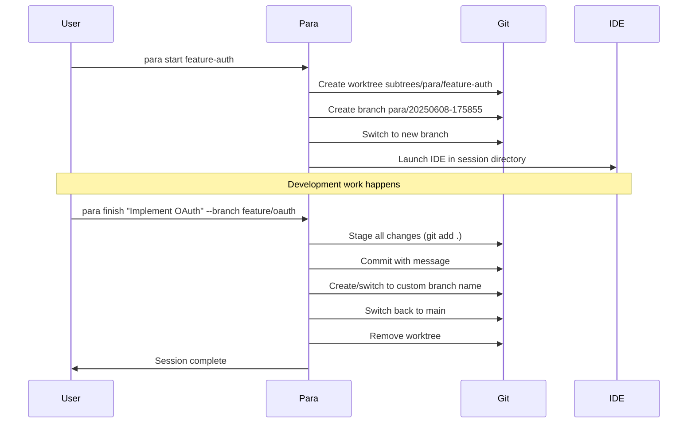
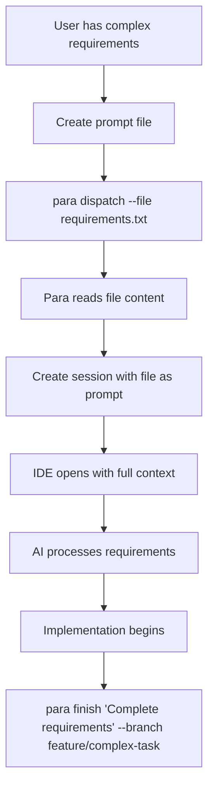
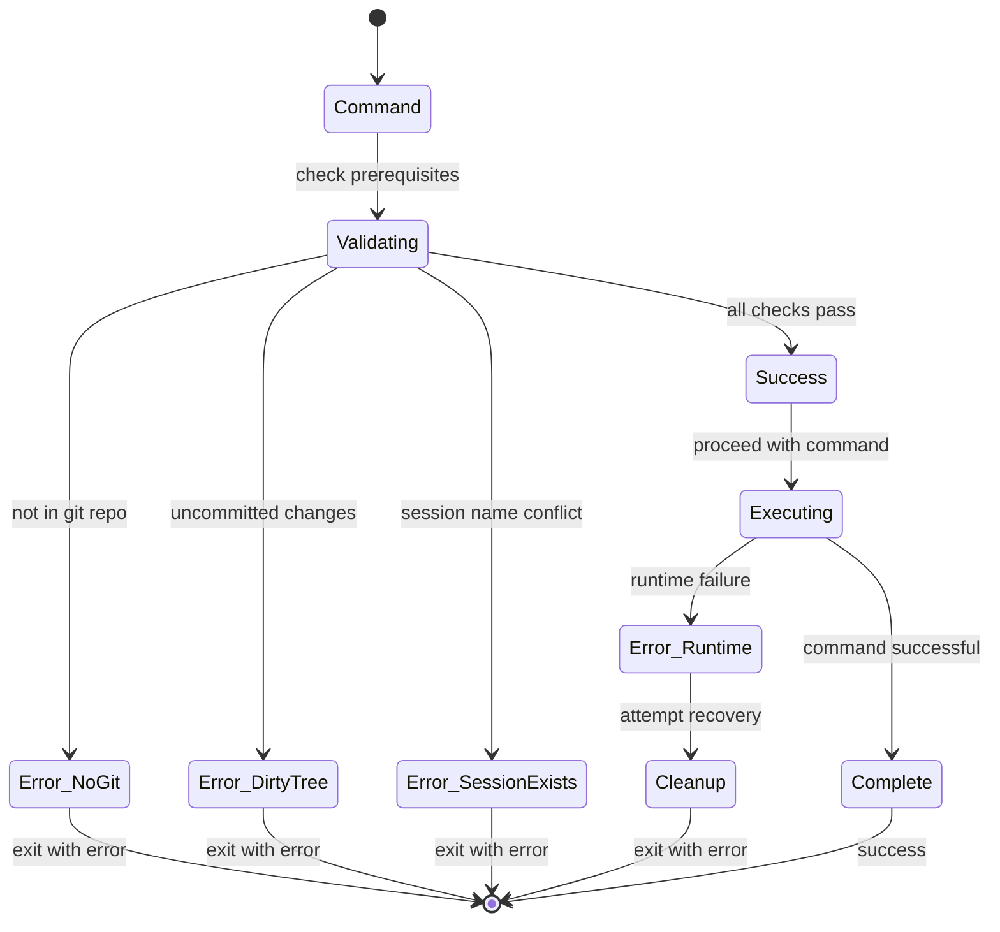
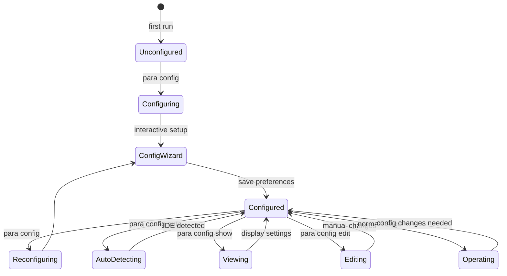

# Para Workflow Documentation

This document explains the Para session management workflow and state transitions using visual diagrams.

> **Note**: For detailed information about IDE window management during integration and conflict resolution, see [IDE_BEHAVIOR.md](./IDE_BEHAVIOR.md).

## Session State Diagram

## Command Flow Diagram

## Session Lifecycle

## File Input Workflow

## Error Handling States

## Configuration States

