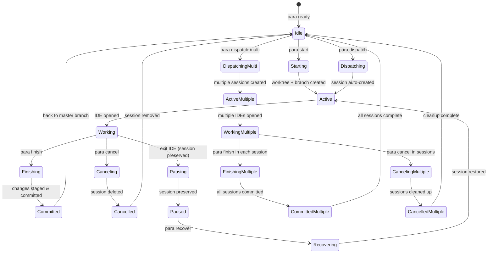
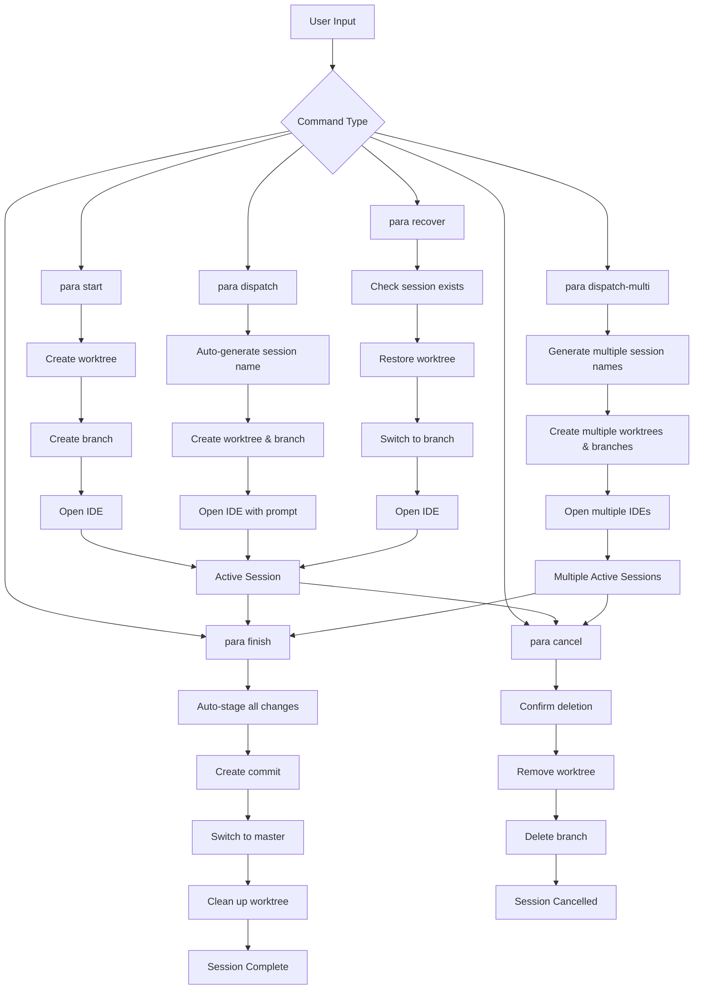
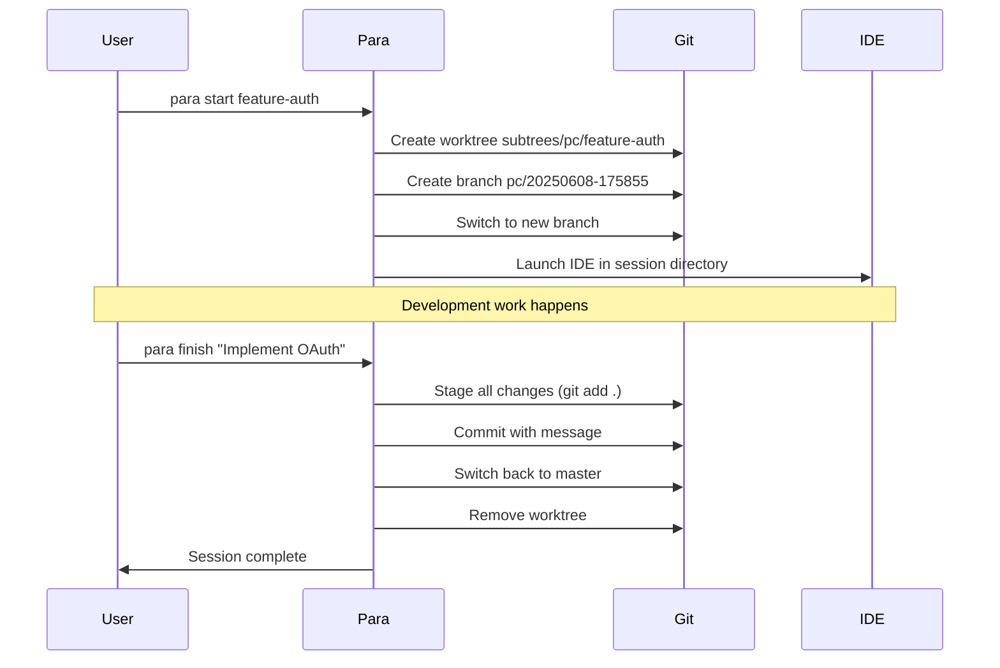
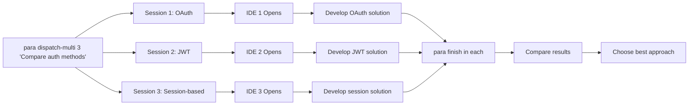
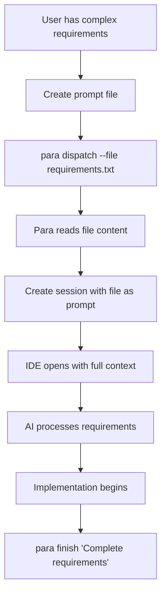

# Para Workflow Documentation

This document explains the Para session management workflow and state transitions using visual diagrams.

## Session State Diagram

## Command Flow Diagram

## Session Lifecycle

## Multi-Session Workflow

## File Input Workflow

## Error Handling States

## Configuration States

