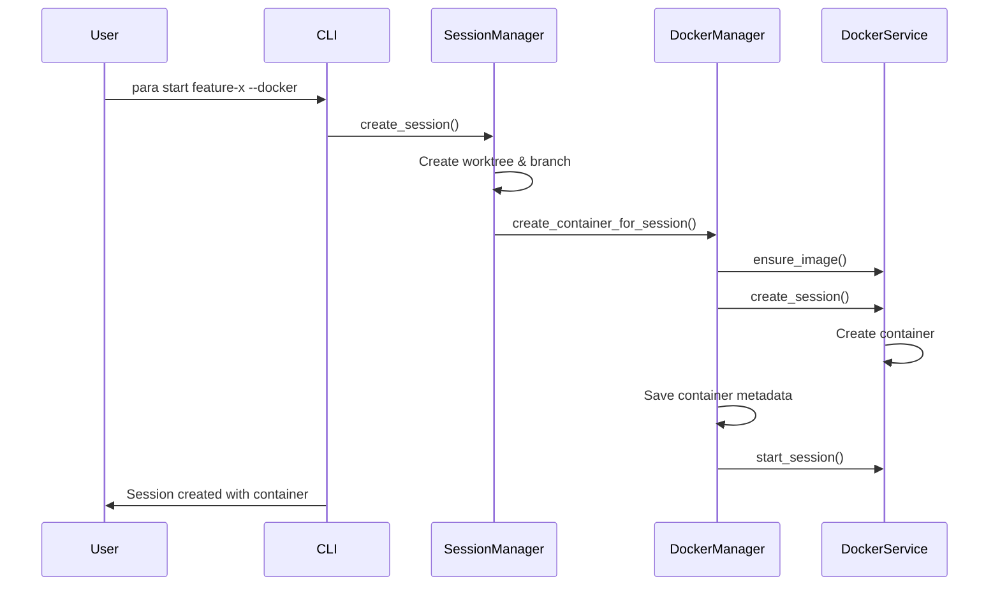
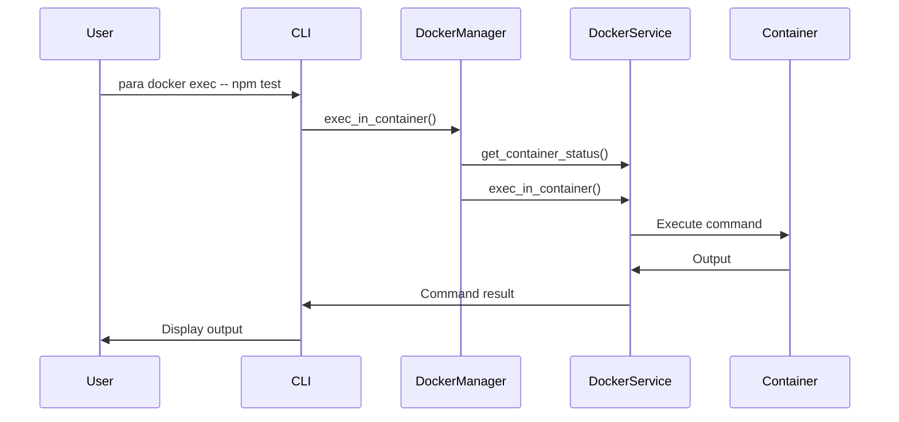
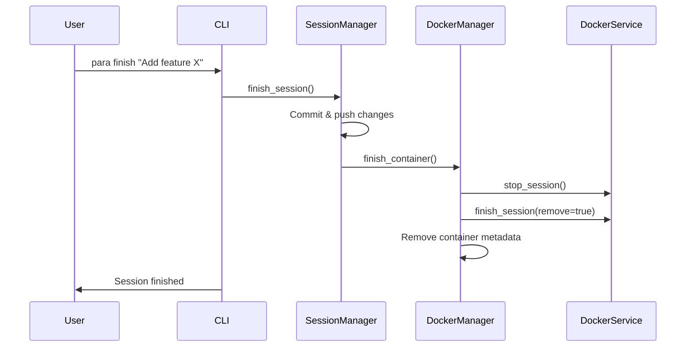

# Para Docker Integration - Comprehensive Design Document

## Executive Summary

This document describes the design for integrating Docker containerization into Para, enabling developers to work in isolated, reproducible environments for each parallel session. The integration maintains Para's philosophy of seamless parallel development while adding container-based isolation and environment consistency.

## Architecture Overview

### Module Structure

```
src/
├── core/
│   ├── docker/                    # New Docker module
│   │   ├── mod.rs                # Module exports
│   │   ├── config.rs             # Docker configuration types
│   │   ├── error.rs              # Docker-specific errors
│   │   ├── manager.rs            # Docker operations coordinator
│   │   ├── service.rs            # Docker service trait
│   │   └── session.rs            # Container session types
│   └── mod.rs                    # Updated to include docker module
├── cli/
│   └── commands/
│       └── docker/               # New Docker commands
│           ├── mod.rs
│           ├── start.rs          # para docker start
│           ├── stop.rs           # para docker stop
│           ├── exec.rs           # para docker exec
│           └── attach.rs         # para docker attach
└── config/
    └── mod.rs                    # Extended with DockerConfig
```

### Key Components

#### 1. DockerService Trait (`service.rs`)

The `DockerService` trait provides an abstraction layer for Docker operations:

```rust
#[async_trait]
pub trait DockerService: Send + Sync {
    async fn create_session(&self, session_name: &str, config: &DockerConfig, working_dir: &Path) -> DockerResult<ContainerSession>;
    async fn start_session(&self, session_name: &str) -> DockerResult<()>;
    async fn stop_session(&self, session_name: &str) -> DockerResult<()>;
    async fn finish_session(&self, session_name: &str, remove: bool) -> DockerResult<()>;
    async fn get_container_status(&self, session_name: &str) -> DockerResult<ContainerStatus>;
    // ... additional methods
}
```

This allows for:
- Multiple implementations (Docker Engine API, Podman, etc.)
- Easy testing with mock implementations
- Future extensibility

#### 2. DockerManager (`manager.rs`)

The `DockerManager` coordinates between Para's `SessionManager` and the `DockerService`:

- Creates containers automatically when sessions start (if configured)
- Manages container lifecycle aligned with session lifecycle
- Handles container metadata persistence
- Provides cleanup for orphaned containers

#### 3. ContainerSession (`session.rs`)

Represents the state of a Docker container associated with a Para session:

```rust
pub struct ContainerSession {
    pub container_id: String,
    pub session_name: String,
    pub status: ContainerStatus,
    pub image: String,
    pub volumes: Vec<VolumeMount>,
    pub ports: Vec<PortMapping>,
    pub environment: HashMap<String, String>,
    // ... additional fields
}
```

#### 4. DockerConfig (`config.rs`)

Extends Para's configuration with Docker-specific settings:

```rust
pub struct DockerConfig {
    pub enabled: bool,
    pub default_image: String,
    pub image_mappings: HashMap<ProjectType, String>,
    pub default_volumes: Vec<VolumeMapping>,
    pub default_resource_limits: ResourceLimits,
    pub network: NetworkConfig,
    // ... additional configuration
}
```

## Integration with Existing Para Workflow

### 1. Session Creation (`para start`)



### 2. Session Work (`para docker exec`)



### 3. Session Completion (`para finish`)



## Configuration Schema

### Main Config Extension

The existing `para/config.json` will be extended:

```json
{
  "ide": { /* existing */ },
  "directories": { /* existing */ },
  "git": { /* existing */ },
  "session": { /* existing */ },
  "docker": {
    "enabled": false,
    "default_image": "ubuntu:latest",
    "image_mappings": {
      "rust": "rust:latest",
      "node": "node:lts",
      "python": "python:3.11"
    },
    "default_volumes": [
      {
        "source": "$WORKTREE",
        "target": "/workspace",
        "read_only": false
      }
    ],
    "default_resource_limits": {
      "cpu_limit": 2.0,
      "memory_limit": 4294967296
    },
    "network": {
      "mode": "bridge",
      "create_custom_network": true,
      "custom_network_name": "para-network"
    }
  }
}
```

### Per-Session Configuration

Sessions can override Docker settings via `.para/docker.json` in the worktree:

```json
{
  "image": "node:18-alpine",
  "volumes": [
    {
      "source": "$HOME/.npm",
      "target": "/root/.npm",
      "read_only": false
    }
  ],
  "ports": [
    {
      "host_port": 3000,
      "container_port": 3000
    }
  ],
  "environment": {
    "NODE_ENV": "development"
  }
}
```

## Status Communication Protocol

Containers communicate with Para via shared JSON files in `.para/state/docker/`:

### Status Updates (Container → Host)

Containers write to `.para/state/docker/{session}/status.json`:

```json
{
  "timestamp": "2024-01-20T10:30:00Z",
  "status": "running",
  "health": "healthy",
  "phase": "testing",
  "progress": {
    "current": 75,
    "total": 100,
    "message": "Running integration tests..."
  }
}
```

### Command Queue (Host → Container)

Para writes commands to `.para/state/docker/{session}/commands.json`:

```json
{
  "commands": [
    {
      "id": "cmd-123",
      "type": "exec",
      "command": "npm test",
      "working_dir": "/workspace"
    }
  ]
}
```

See [docker-status-protocol.md](docker-status-protocol.md) for full protocol details.

## CLI Commands

### New Docker Commands

```bash
# Start container for current session
para docker start [session]

# Stop container
para docker stop [session]

# Execute command in container
para docker exec [session] -- <command> [args...]

# Attach to container shell
para docker attach [session]

# View container logs
para docker logs [session] [--follow] [--tail n]

# List all containers
para docker list

# Clean up orphaned containers
para docker cleanup
```

### Modified Existing Commands

```bash
# Create session with Docker container
para start <name> --docker [--image <image>]

# Dispatch with Docker
para dispatch <name> "prompt" --docker

# Monitor shows container status
para monitor  # Now includes container health
```

## Implementation Approach

### Phase 1: Core Infrastructure
1. Implement `DockerService` trait
2. Create `DockerEngineService` implementation using Docker API
3. Implement `DockerManager` coordination layer
4. Add configuration schema and parsing

### Phase 2: Basic Integration
1. Extend `para start` with `--docker` flag
2. Implement `para docker` subcommands
3. Add container lifecycle management
4. Integrate with session finish/cancel

### Phase 3: Enhanced Features
1. Implement status communication protocol
2. Add container monitoring to `para monitor`
3. Implement resource management
4. Add health checks and auto-recovery

### Phase 4: Advanced Integration
1. Multi-container support for microservices
2. Docker Compose integration
3. Container image building
4. Registry management

## Testing Strategy

### Unit Tests

```rust
#[cfg(test)]
mod tests {
    use super::*;
    use crate::test_utils::*;

    #[test]
    fn test_docker_config_parsing() {
        let config_json = r#"{"enabled": true, "default_image": "rust:latest"}"#;
        let config: DockerConfig = serde_json::from_str(config_json).unwrap();
        assert!(config.enabled);
        assert_eq!(config.default_image, "rust:latest");
    }

    #[tokio::test]
    async fn test_container_lifecycle() {
        let mock_service = MockDockerService::new();
        let manager = DockerManager::new(Arc::new(mock_service), test_config(), docker_config());
        
        // Test container creation
        let session = create_test_session("test-session");
        let container = manager.create_container_for_session(&session).await.unwrap();
        assert_eq!(container.session_name, "test-session");
        
        // Test container start/stop
        manager.start_container("test-session").await.unwrap();
        manager.stop_container("test-session").await.unwrap();
    }
}
```

### Integration Tests

Using the `testcontainers` crate:

```rust
#[cfg(test)]
mod integration_tests {
    use testcontainers::*;

    #[tokio::test]
    async fn test_real_container_operations() {
        let docker = clients::Cli::default();
        let service = DockerEngineService::new();
        
        // Test with real Docker daemon
        service.health_check().await.expect("Docker daemon should be available");
        
        // Create and manage test container
        let config = create_test_docker_config();
        let container = service.create_session("test", &config, Path::new("/workspace")).await.unwrap();
        
        // Verify operations
        assert!(container.exists());
    }
}
```

## Error Handling

All Docker operations use the custom `DockerError` type with specific error cases:

- `DaemonNotAvailable`: Docker daemon connection failed
- `ContainerNotFound`: Requested container doesn't exist
- `ContainerAlreadyRunning`: Attempted to start running container
- `ImageNotFound`: Specified image not available
- `ResourceLimitExceeded`: Container exceeded resource limits

Errors provide context and recovery suggestions:

```rust
match manager.start_container(session_name).await {
    Ok(_) => println!("Container started"),
    Err(DockerError::DaemonNotAvailable(msg)) => {
        eprintln!("Docker daemon not available: {}", msg);
        eprintln!("Please ensure Docker is installed and running");
    }
    Err(e) => eprintln!("Failed to start container: {}", e),
}
```

## Security Considerations

1. **Container Isolation**: Each session runs in isolated container
2. **Resource Limits**: Prevent resource exhaustion
3. **Volume Mounts**: Careful validation of mount paths
4. **Network Isolation**: Custom network per para instance
5. **Secrets Management**: Never persist secrets in status files

## Performance Considerations

1. **Image Caching**: Pre-pull common images
2. **Layer Reuse**: Share base layers between containers
3. **Resource Pooling**: Reuse stopped containers when possible
4. **Async Operations**: All Docker operations are async
5. **Status Caching**: Cache container status with TTL

## Future Enhancements

1. **Kubernetes Support**: Deploy sessions to K8s clusters
2. **Cloud Integration**: Use cloud container services
3. **GPU Support**: Enable GPU passthrough for ML workflows
4. **Rootless Containers**: Support Podman and rootless Docker
5. **Container Templates**: Pre-configured development environments

## Migration Guide

For existing Para users:

1. **Opt-in**: Docker support is disabled by default
2. **Backward Compatible**: All existing workflows continue to work
3. **Gradual Adoption**: Can enable Docker per-session
4. **Easy Rollback**: Can disable Docker without losing work

## Conclusion

This Docker integration design maintains Para's core philosophy while adding powerful containerization capabilities. The modular architecture ensures the feature is optional, testable, and extensible for future enhancements.