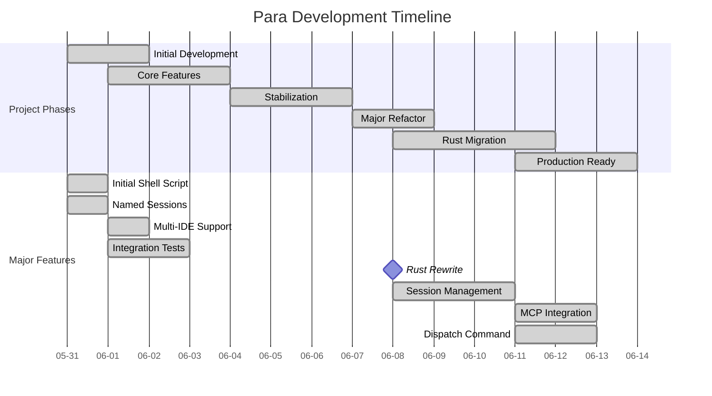
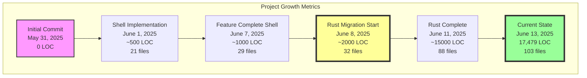
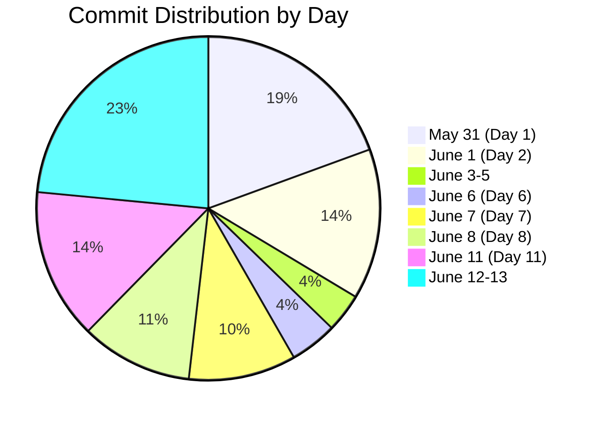
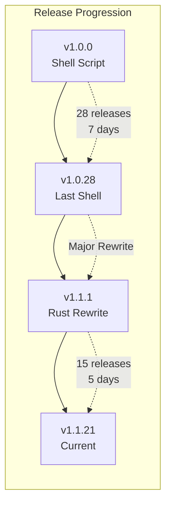
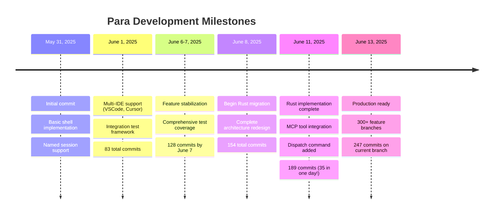
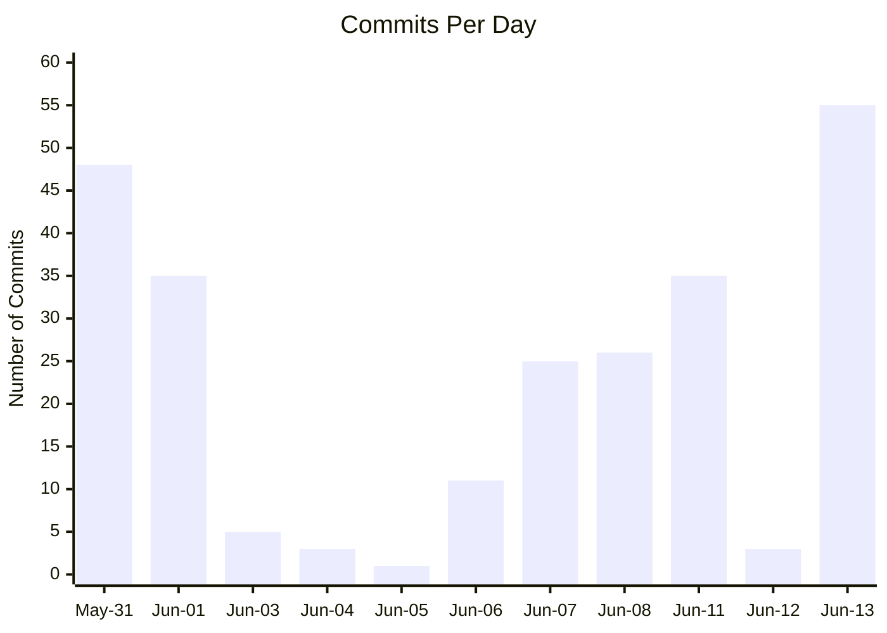
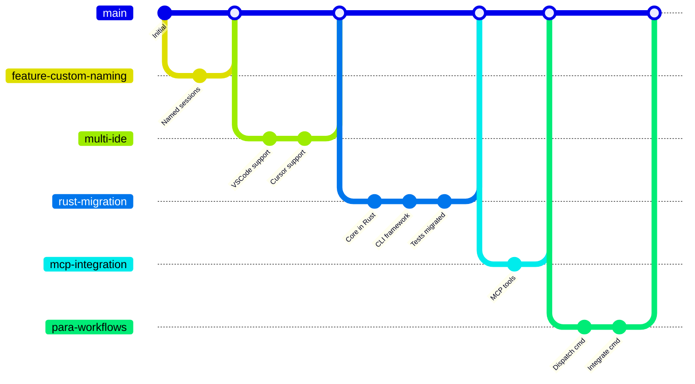

# Para Project Git History Visualization

## Project Evolution Overview

This document provides a comprehensive visualization of Para's development journey from May 31, 2025 to June 13, 2025.

## Key Statistics

- **Total Commits**: 247 (on main branch: 294)
- **Development Period**: 14 days
- **Current Lines of Code**: 17,479 (Rust)
- **Total Files**: 103 source files
- **Released Versions**: 43 releases (v1.0.0 to v1.1.21)
- **Active Branches**: 300+ feature branches

## Mermaid Visualization

## Development Velocity

## Branch Strategy Evolution

## Summary of Key Findings

### Rapid Development
- **14 days** from inception to production-ready tool
- **247 commits** showing active, iterative development
- **43 releases** demonstrating continuous delivery approach

### Major Architecture Shift
- Started as a **Bash script** (May 31)
- Complete **Rust rewrite** began June 8
- **17x code growth** from ~1,000 to 17,479 lines

### Feature Evolution
1. **Phase 1** (May 31): Basic git worktree wrapper
2. **Phase 2** (June 1): Multi-IDE support, named sessions
3. **Phase 3** (June 6-7): Test framework, stabilization
4. **Phase 4** (June 8): Rust migration begins
5. **Phase 5** (June 11): MCP integration, dispatch features
6. **Phase 6** (June 13): Production deployment

### Development Patterns
- **Peak days**: May 31 (48), June 13 (55), June 1 (35), June 11 (35)
- **Quiet period**: June 3-5 (likely planning Rust migration)
- **300+ branches** showing extensive parallel development

### Technology Stack Evolution
- Shell → Rust (primary language)
- Simple scripts → Modular architecture
- Basic git wrapper → Full IDE integration platform

The project demonstrates excellent software engineering practices with test-driven development, continuous integration, and rapid iteration cycles.